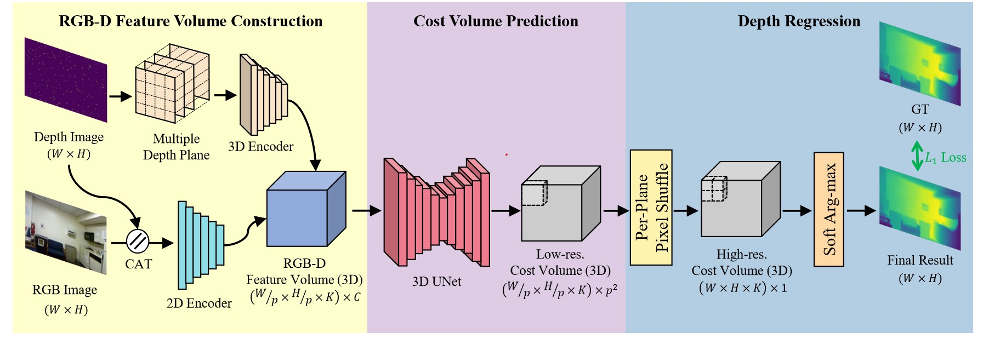
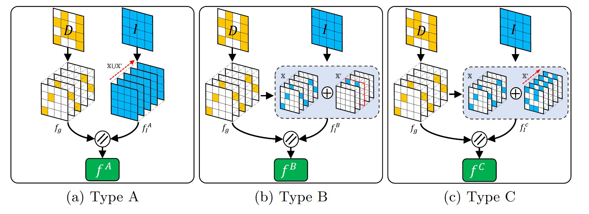

# RGB-D feature volume construction
## Multiple Depth Planes

3D encoder requires a depth image to be converted into a multiple-depth-plane representation.

A pixel position $u = (x, y)$ in a depth image D(·) is related to a 3D position $x \in R^3$ within a view frustum of the image as $x = D(u)K^{-1}\widetilde{u}$ where K is a 3×3 matrix that includes depth camera intrinsic parameters,  $\widetilde{u}$ is homogeneous coordinates [u, 1]T of u, and D(u) is the depth value at the pixel position u. We need to quantize the 3d position into voxel grid so that 3D convolution can be performed.

To construct the voxel grid, we need to predefine only the number K of uniformly-spaced depth planes $\{d_k\}_k=1:K$ because x- and y-axes resolution can be naturally determined to be the same as in the depth image.

The resolution of the voxel grid then becomes W × H × K.

The 3D position x = (x, y, D(x, y)) of a depth image pixel in the representation is easily quantized to a cell $x_c$ of the voxel grid as:
$$ x_c = (x, y, k^′) $$
$$ k^′ = \underset{k}{\operatorname{\argmin}} |D(x, y) − dk|$$
we obtain a set of valid cells $\{x_c^n\}_n=1:N$in the voxel grid. where N is the number of valid cells.

Then, we construct an input geometry feature volume $f^{in}_g \in \mathbb{R}^{W\times H\times K \times M}$ on the voxel grid as:
$$f^{in}_g(x^′) = 
\begin{cases}
sn, x^′ \in \{x_c^n\}_n=1:N\\
\overrightarrow{0}, otherwise
\end{cases}$$

If $x^′$ corresponds to a valid depth pixel $x_c^n$, we store sn in $x^′$, where sn is a M -dimensional feature vector. Otherwise, a M dimensional zero vector is stored in $x^′$. We set M to one and sn to $D(x, y) − dk^′$ , which is the residual of a depth pixel from the nearest predefined depth plane.

## RGBD-feature Volume
An RGB-D feature volume is a feature volume in the multiple-depth-plane representation, which is defined as element-wise concatenation of a geometric feature volume $f_g$ and an image feature volume $f_I$ .

The author propose three types of feature fusion methods.

### Type A:
we generate an image feature volume $f^A_I$ to be filled with the same image features along the depth-axis as follows: 
$$f^A_I (x, y, k^′) = I(x, y), ∀k^′ ∈ \{k\}_k=1:K$$ 
where $I$ denotes a 2D image feature map calculated by feeding an input RGB-D image into a 2D encoder

### Type B:
Since a Type A feature volume allocates image features to its all cells regardless of whether the corresponding depth pixels are valid or not, it does not consider 3D positional information of image features explicitly. 

In contrast, Type B considers the valid depth values of pixels for image feature allocation. To be specific, for a pixel with a valid depth, we allocate its 2D image feature to only the corresponding 3D cell in the image feature volume $f^B_I$ . For pixels with invalid depths, we allocate their 2D image features to the corresponding cells in the middle depth plane of $f^B_I$ .

### Type C:
A Type C feature volume is generated in the same manner as Type B except that the image feature of each pixel with invalid depth is repeatedly allocated to the cells of f C I , traversing along the depth-axis.

## Sparse 3D Conv

# Cost volume prediction and depth regression

## Cost Volume

### 3D UNet
### Pseudo 3D Conv
### Pixel Shuffle

## Depth Regression
We can regress a completed depth map $D^′(·)$ by applying the softmax operator $\sigma( · )$ to the upsampled cost volume $V_c \in \mathbb{R}^{W ×H×K}$ along the depth-axis and using the following equation
$$D^′(x, y) =\sum^K_{k=1}d_k × p^k_{x,y} $$
$$p_{x,y} = \sigma(V_c(x, y, :))$$
where $d_k$ is the predefined depth value of the k-th plane, (x, y) is an image pixel position, K is the number of depth planes, $V_c(x, y, :)$ is a K-dimensional vector along the depth-axis within the cost volume, and px,y is a probability vector obtained by the softmax operator σ( · ) for K depth planes at (x, y).