# Base Pipeline : CostDCNet

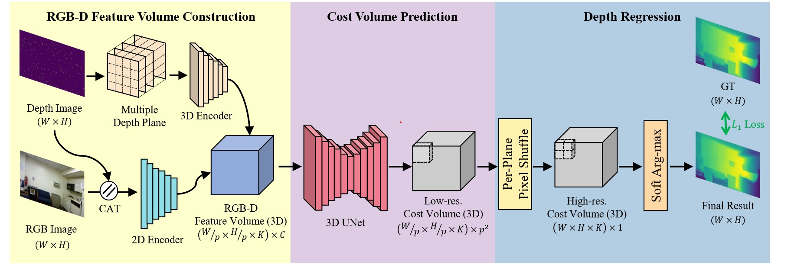

# Dataset: Matterport

    dataset/
    ├── 17DRP5sb8fy
    │   ├── render_depth
    │   │   ├── resize_00ebbf3782c64d74aaf7dd39cd561175_d0_0_mesh_depth.png
    │   │   └── ...
    │   ├── undistorted_color_images
    │   │   ├── resize_00ebbf3782c64d74aaf7dd39cd561175_i0_0.jpg
    │   │   └── ...
    │   └── undistorted_depth_images
    │       ├── resize_00ebbf3782c64d74aaf7dd39cd561175_d0_0.png
    │       └── ...
    └─── 1LXtFkjw3qL
         └── ...

Following matterport3D dataset, the data orginization in this repository is shown above. In experiment, all images are resized to 256x320.
## Undistorted Color Image
undistorted_color_images : resized original rgb images

## Undistorted Depth  ( Raw depth image)
Reprojected depth images aligned with the color images. Every depth image a 16 bit PNG containing the pixel's distance in the z-direction from the camera center (not the euclidean distance from the camera center), `0.25 mm` per value (divide by 4000 to get meters).

## Render Depth ( Ground Truth image)
render_depth : ground truth depth map generated by multiview-reconstruction method (also in yindaZ's work)

## Example

    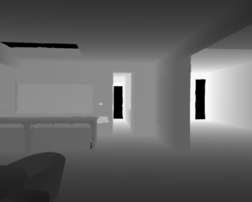

# Our Data for evaluation

    dataset/
    ├── cropped_interpo_depth
    │   ├── frame-000000.depth.png
    │   │   └── ...
    └── cropped_rgb
        ├── frame-000000.color.png
        └── ...

In experiment, all images are cropped to 1080 * 864
## Cropped Color Image
Original RGB Image cropped to 1080 * 864. In `PNG` format.

## Cropped interpolated depth
Every depth image a `16` bit `PNG`. Depth scale $1000$, `1mm` per value (divide bt 1000 to get meters). Depth image are aligned to RGB image, and interpolated by linear interpolation.

## Example

    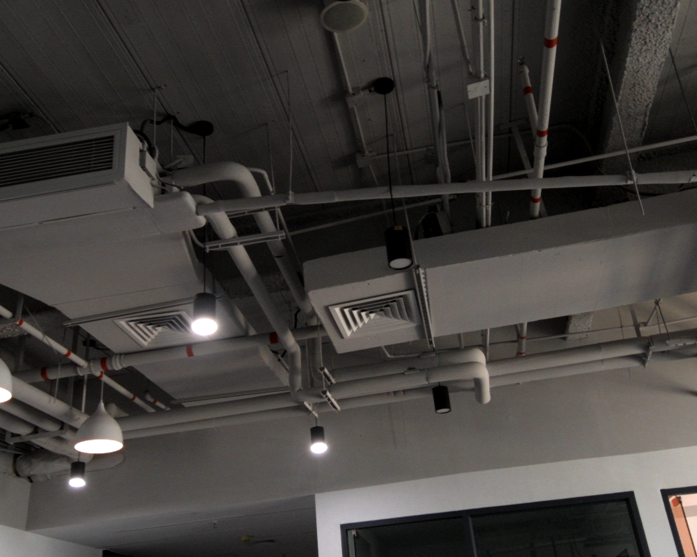

# Data Preprocessing

1. In training stage, Matterport Ground Truth depth and Raw Depth are dvided by 4000(convert to get meters). In evaluating stage, our data's groud truth depth and raw depth are diveded by 1000 to get meters.
2. RGB image are normalized to 0~1, (divided by 255).

# Training using Silog Loss:

## Silog Loss

$$ L = \alpha\sqrt{\frac{1}{K}\sum_i{\Delta d_i^2} - \frac{\lambda}{K^2}(\sum_i{\Delta d_i})^2}$$

where $\Delta d_i = \log{\hat{d_i}} - \log{d_i^*}$. 

$\hat{d_i}$ is the predicted depth value and $d_i^*$ is the ground truth depth value.

$\lambda$ is a variance minimizing factor, and $\alpha$ is a scale constant. In this experiment, $\lambda$ is set to 0.85 and $\alpha$ is set to 10.

K is the number of valid depth values in GT depth image.

## Training Input and Output From Matterport Dataset

    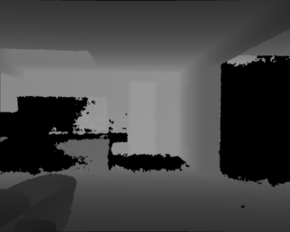

    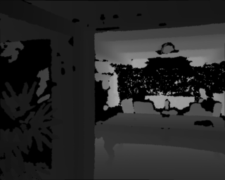

## Testing Input and Output of Our data

    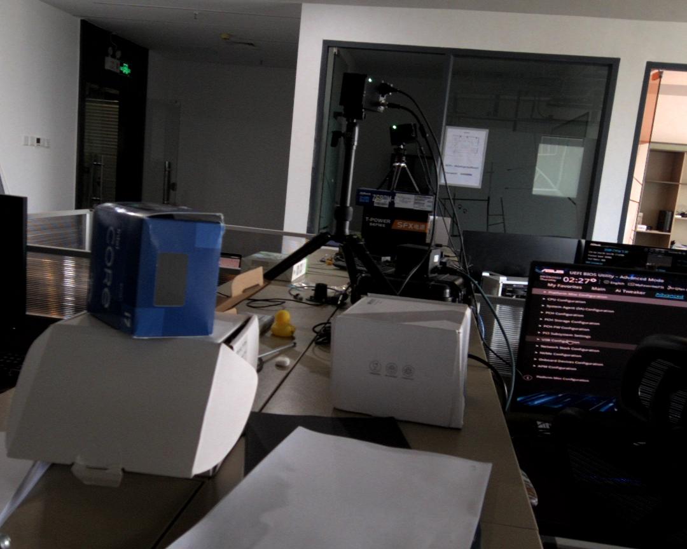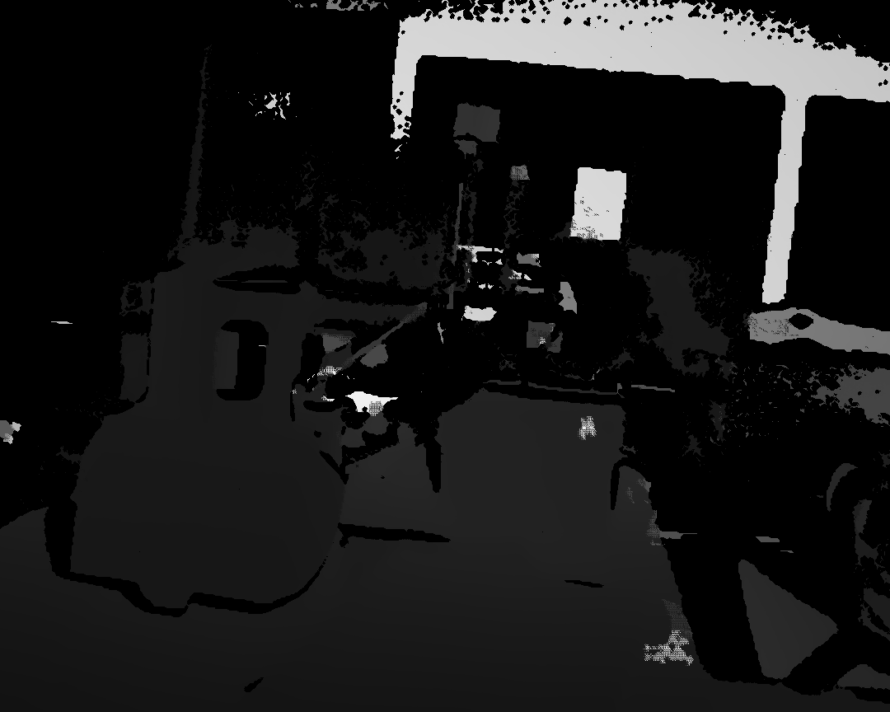

    

    

    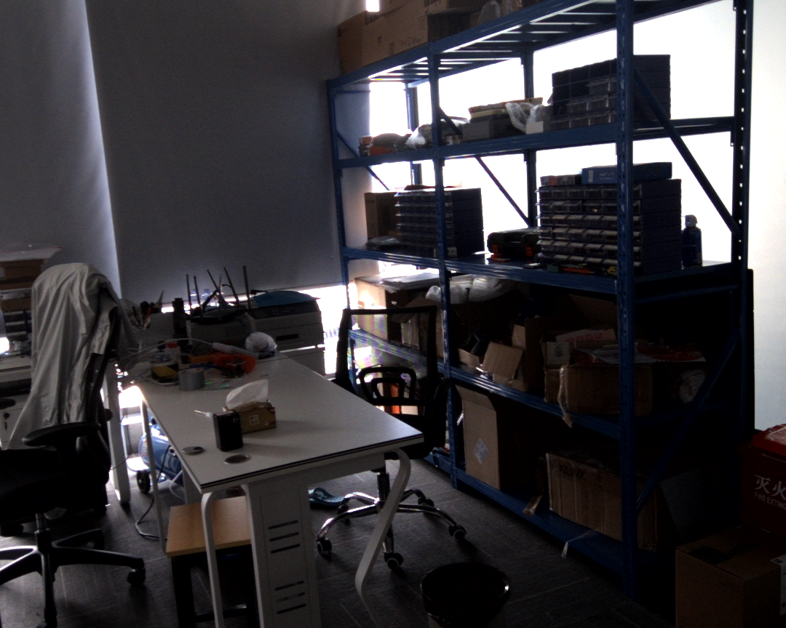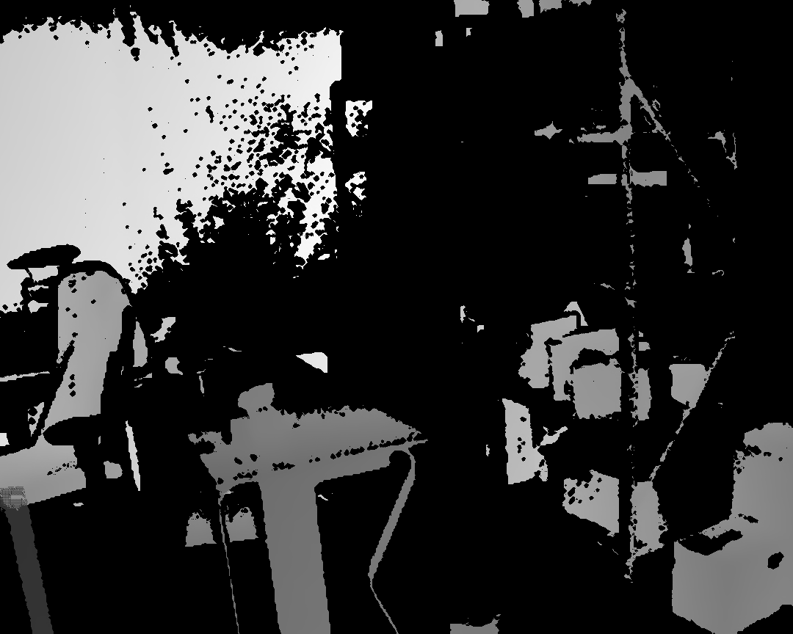

    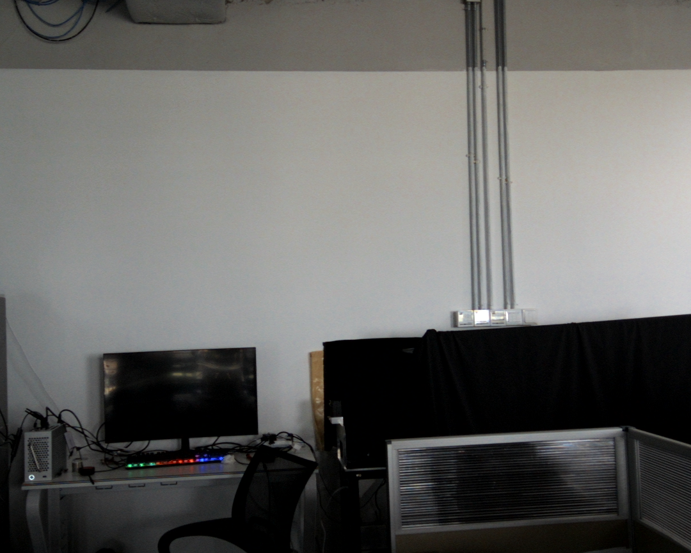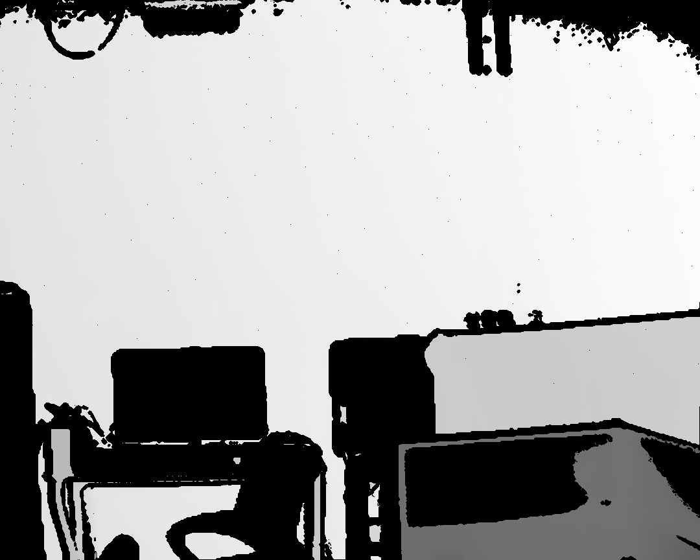

    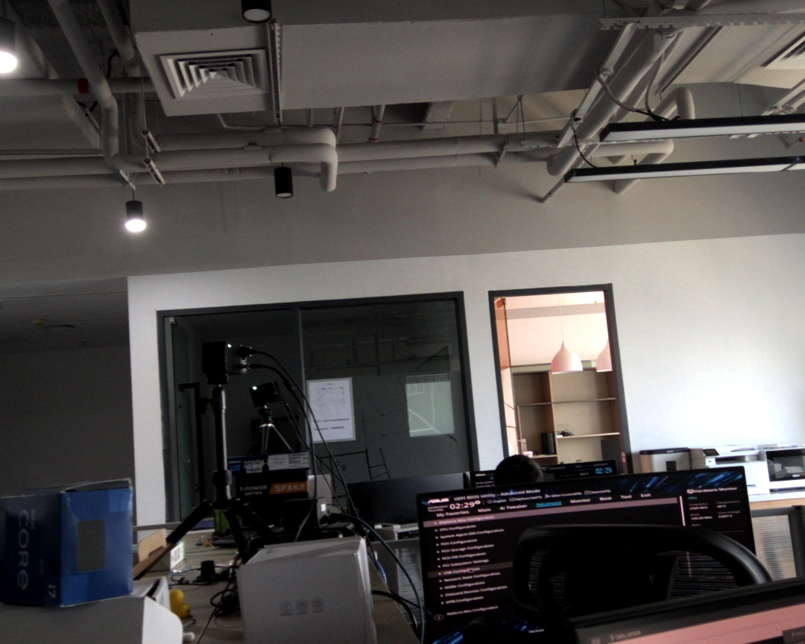

# Training Using L1 loss + gradient loss

Use Gradient loss proposed by Learning an Efficient Multimodal Depth
Completion Model.

$$L_{cgdl}(\hat{Y}, Y) = ||F(\hat{Y}) - F(Y)||_p * E(sgn(Y\in v))$$

$$L(\hat{Y}, Y) = L_{l1}(\hat{Y}, Y) + \lambda*L_{cgdl}(\hat{Y}, Y)$$

$L_{cgdl}$ is corrected gradient loss. $\hat{Y}$ is the ground truth depth. $Y$ is the predicted depth.

## Training Input and Output

    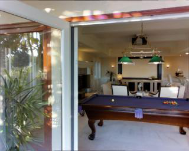
    
    
    

    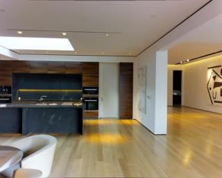

## Ourdata

    
    
    

    
    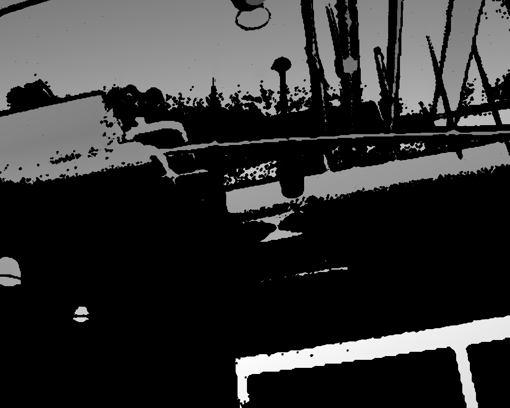
    

    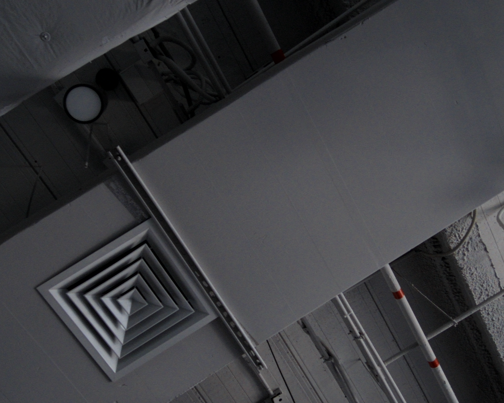
    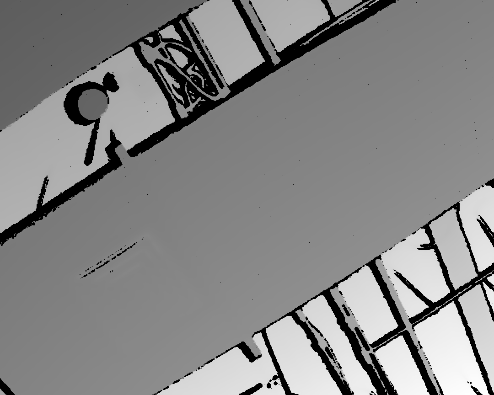
    

    
    
    

    
    
    

    
    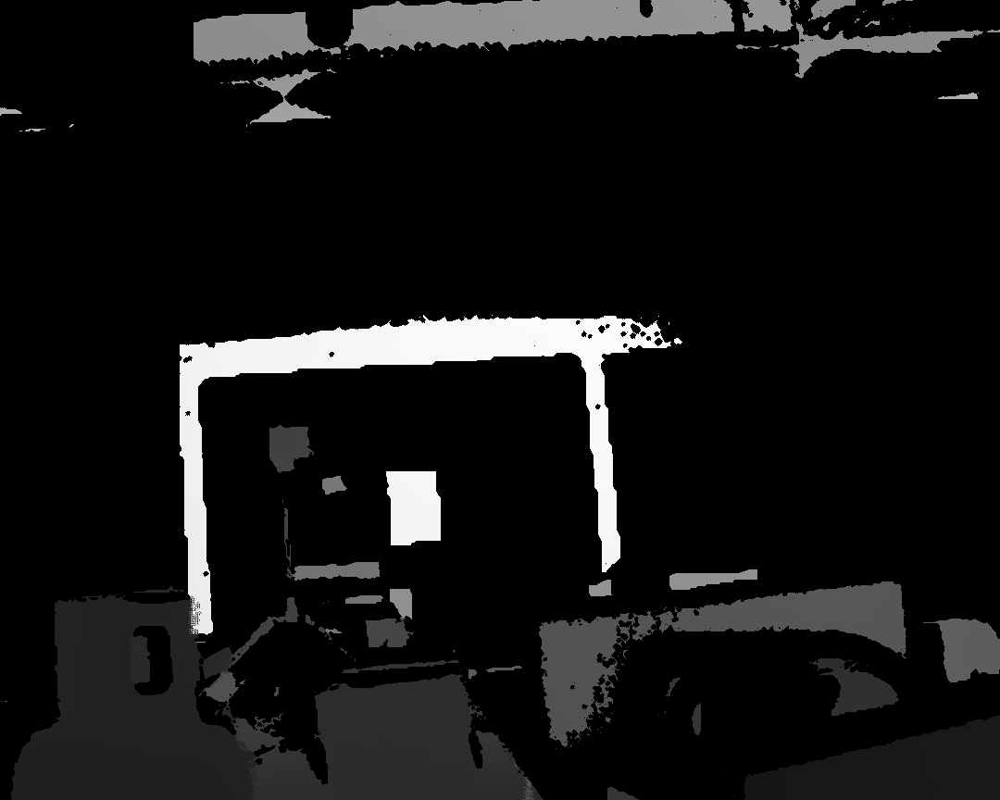
    

