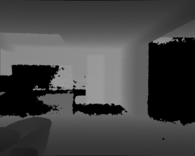
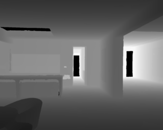
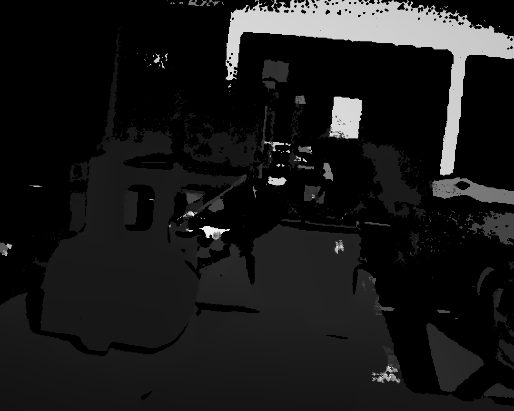
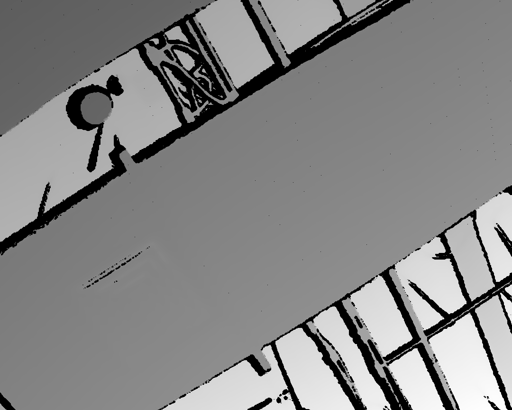
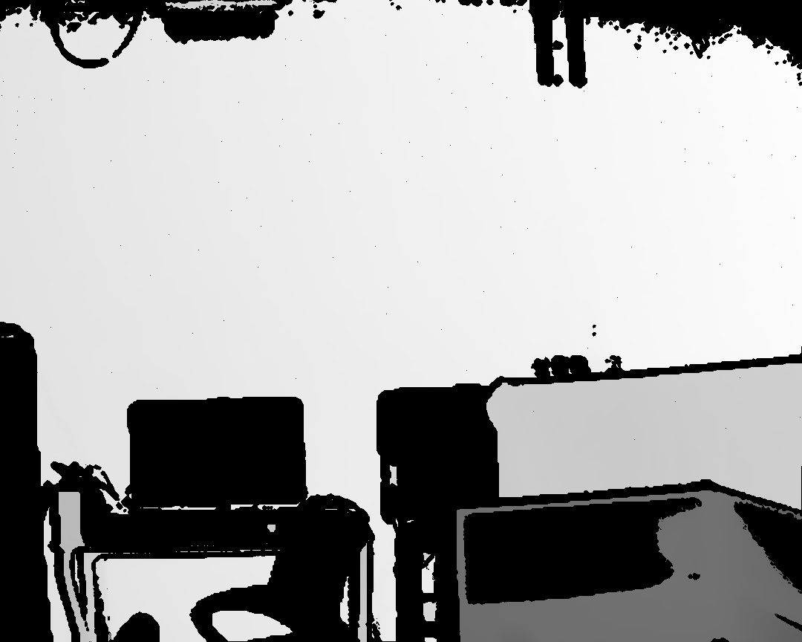

# Depth Completion

## 2022/12/05

### 问题一： 深度图插值

代码修改后：处理17张图，共消耗16.27s, 平均0.97s/picture.

代码运行速度日志：

```python
Wrote profile results to interpolation_np.py.lprof
Timer unit: 1e-06 s

Total time: 18.8987 s
File: data_preparation/interpolation_np.py
Function: main at line 27

Line #      Hits         Time  Per Hit   % Time  Line Contents
==============================================================
    27                                           @profile
    28                                           def main():
    29                                               
    30        17         10.7      0.6      0.0      for i in range(len(depth_names)):
    31                                                   
    32        17          7.4      0.4      0.0          start_t = time.time()
    33        17         17.7      1.0      0.0          name = depth_names[i]
    34        17          8.8      0.5      0.0          path = depth_paths[i]
    35                                                   
    36        17         37.6      2.2      0.0          print(name)
    37        17     158233.6   9307.9      0.8          img = cv2.imread(path, cv2.IMREAD_ANYDEPTH)
    38        17      13927.1    819.2      0.1          img = np.asarray(img).astype(np.float32)
    39                                                   
    40        17      59186.4   3481.6      0.3          mask = np.where(img>0)
    41        17     575900.9  33876.5      3.0          valid_pos = np.array(list(zip(mask[0],mask[1])))
    42                                           
    43                                                   
    44        17         51.0      3.0      0.0          width, height = img.shape[1], img.shape[0]
    45        17         90.1      5.3      0.0          center = np.array([2,2])
    46        17         34.3      2.0      0.0          center_mask = (np.array([2]), np.array([2]))
    47   1937593     261061.5      0.1      1.4          for pos in valid_pos:
    48   1937593     314179.9      0.2      1.7              row, col = pos[0], pos[1]
    49   1933917    1296387.3      0.7      6.9              if row-2 >= 0 and col-2 >= 0 and row+2 < height and col+2 < width:
    50   1933917    1057874.6      0.5      5.6                  kernel = img[row-2:row+3, col-2:col+3]
    51   1933917    1446948.5      0.7      7.7                  kernel_cp = img[row-2:row+3, col-2:col+3].copy()
    52   1933917    3309593.1      1.7     17.5                  valid_mask = np.where(kernel>0)
    53   1933917    3903578.4      2.0     20.7                  interpo_mask = ((valid_mask[0] + center_mas[0]) // 2, (valid_mask[1] + center_mask[1]) // 2)
    54                                           
    55   1933917    3267164.7      1.7     17.3                  inter_val = (kernel[valid_mask] + kernel[2,2]) / 2
    56                                                           
    57   1933917    1155391.7      0.6      6.1                  kernel[interpo_mask] = inter_val[:]
    58   1933917    1851551.4      1.0      9.8                  kernel[valid_mask] = kernel_cp[valid_mask]
    59                                                           
    60                                                           
    61        17      14793.1    870.2      0.1          img = img.astype(np.uint16)
    62        17        248.9     14.6      0.0          outpath = os.path.join(out_PATH, name)
    63        17     212007.4  12471.0      1.1          cv2.imwrite(outpath, img)
    64        17         40.9      2.4      0.0          end_t = time.time()
    65        17        353.2     20.8      0.0          print(end_t - start_t) 
```

大部分时间消耗在

```python
    52   1933917    3309593.1      1.7     17.5                  valid_mask = np.where(kernel>0)
    53   1933917    3903578.4      2.0     20.7                  interpo_mask = ((valid_mask[0] + center_mas[0]) // 2, (valid_mask[1] + center_mask[1]) // 2)
    54                                           
    55   1933917    3267164.7      1.7     17.3                  inter_val = (kernel[valid_mask] + kernel[2,2]) / 2
```

cupy 对性能没有提升， 原因可能在于我代码中没有对大型数组进行操作。

解决方法：是不是代码写错了，应该对图片进行批量操作，而不是for循环处理单张图片。

## CostDCNet 训练

数据集Matterport

training dataset around 100K images

testing dataset 474 images

image size : 320*256


训练10 epoch


调整学习率后继续训练20epoch


结果
raw depth






Evaluation Metrics:

[Test] 

RMSE(root mean squared error): 0.8952 

REL(relative mean absolute error): 0.6498 


问题1： paper中训练50epoch,每20epoch调整一次learning 。实验的时候训练5-10epoch loss 不再下降。

问题3：对于大片缺失的深度图（如下图），预测结果差

raw depth


## 2022/12/07

使用cpu multiprocess 并行处理图片。 处理16张共花费5.66s。 平均0.35s/picture。

还在研究怎么用gpu做图片并行处理。

## 2022/12/09

1. 改进插值，处理16张共3.22s

2. 在data0929数据集上测试costDCNet

图片大小由1080\*1920 裁剪为 864\*1080， 与网络训练输入比例相匹配

结果如下：

<center class="half">
    
</center>

<center class="half">
    
</center>

<center class="half">
    
</center>

<center class="half">
    
</center>

<center class="half">
    
</center>